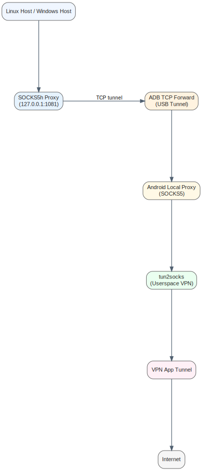

# Reverse Tethering in Userspace VPN Environments via ADB Port Forwarding


---

## Overview

This repository presents an **applied network research case study** demonstrating reverse tethering in constrained Android environments.  
It illustrates how to pivot network traffic from a Linux host through an Android device running a **userspace VPN (tun2socks-based)** without root or permanent system modifications, using **ADB port forwarding** and a **SOCKS5h proxy**.

Key objectives:

- Explore application-layer tunneling under constrained environments
- Achieve DNS-safe traffic routing
- Analyze architectural limitations of userspace VPNs
- Provide defensive considerations for practical deployment

> Intended as a **research and educational resource** for network behavior analysis, pivoting strategies, and tunneling techniques.

---

## Architecture Diagram



**High-level flow:**

```

Linux Host → SOCKS5h Proxy → ADB → USB → Android Proxy App → tun2socks → Userspace VPN → Internet

```

- SOCKS5h ensures DNS queries are resolved inside the VPN tunnel.  
- ADB forwards TCP ports over USB, bypassing Android tethering restrictions.  
- Traffic remains fully reversible and requires no root access.

---

## Lab Setup

- **Android:** 15+ or compatible  
- **Linux Host:** Ubuntu/Debian or equivalent  
- **ADB Tools:** android-tools-adb  
- **VPN App:** Example userspace VPN using tun2socks  
- **Constraints:**  
  - No root  
  - No system-level config changes  
  - USB debugging enabled for the host

See [`lab-setup/environment.md`](lab-setup/environment.md) for full details.

---

## Methodology

The project is structured in three stages:

1. **Problem Analysis**  
   - Standard tethering fails: userspace VPN bypasses NAT and tethering stack.  
   - No sharable network interface exposed.

2. **Pivot Design**  
   - ADB port forwarding creates a TCP tunnel from host → Android.  
   - SOCKS5h proxy ensures DNS queries resolve inside VPN tunnel.  
   - Application-layer traffic bypasses Android restrictions entirely.

3. **Implementation**  
   - Install and configure the proxy app  
   - Forward TCP ports with ADB  
   - Verify DNS safety and tunnel functionality

Detailed implementation commands are in [`methodology/implementation.md`](methodology/implementation.md).

---

## Security Considerations

While designed for lab research:

- **ADB trust model:** Only connect trusted hosts; a compromised host can fully access the device.  
- **Proxy exposure:** Ensure proxy binds to localhost to prevent external access.  
- **Detection surface:** Monitoring tools may detect abnormal proxy usage or port forwarding.  
- **Mitigation:** Disable USB debugging in production, monitor localhost services, enforce device management policies.

Full defensive analysis: [`security-considerations/defensive-analysis.md`](security-considerations/defensive-analysis.md)

---

## References

- Android ADB documentation  
- SOCKS5 / SOCKS5h RFCs  
- tun2socks technical notes  
- Application-layer tunneling research

Additional references: [`references/technical-notes.md`](references/technical-notes.md)

---

## Key Takeaways

- Reverse tethering via ADB is effective in constrained VPN environments.  
- Application-layer pivoting enables routing without root or system changes.  
- SOCKS5h ensures DNS-safe tunneling.  
- Methodology applicable as a **research case study** in constrained, segmented, or industrial network scenarios.

---

*Author: RUGERO Tesla (404saint)*  
*Industrial & Network Security | Offensive Security Research | ICS/OT-focused*
